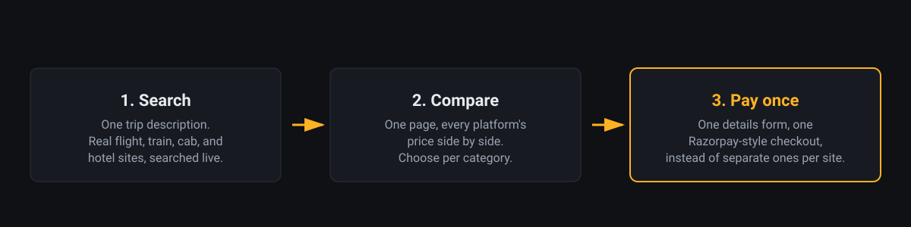

# Travel Concierge Agent

**SLAB Hackathon Contributors**

| Name | Registration Number |
| --- | --- |
| Parth Pancholi | 25BCE10443 |
| Adarsh Pratap Singh | 25BCE10285 |
| Disha Dashore | 25BAI10444 |

Booking a trip means visiting a different site for flights, trains, cabs,
and hotels, comparing prices manually across tabs, then entering the same
name, contact, and payment details on every single site before you can pay.

Travel Concierge Agent takes one plain-language trip description, searches
real flights, trains, cabs, and hotel sites for it, and brings every result
into a single price comparison page. Pick the option you want per category,
then enter your details once, through a single payment screen, instead of
repeating them on each platform's own checkout.



## What it does

- **Search** — one trip description (destination, dates, budget,
  travelers) drives a live search across ixigo Flights, ixigo Trains,
  JustDial, MakeMyTrip, and Goibibo, plus a plain Google search for places
  to explore at the destination.
- **Compare** — every platform's result lands on one page: platform,
  price, and a short description, grouped by category, with a button to
  choose the one you want.
- **Pay once** — a single details-and-payment screen collects name,
  contact, traveler information, and payment details exactly once, through
  one Razorpay-style checkout, instead of five separate ones. A voice-fill
  option can walk you through the form by speaking your answers.

## How it's built

The search step is a browser agent built on
[webcmd](https://github.com/agentrhq/webcmd), the self-learning browser
infrastructure this repository is built on. The agent is driven by Claude:
given the trip description, it loads webcmd's browser skill and drives a
real Chrome session itself, deciding what to click and type on each live
page rather than following a fixed script. The comparison page and the
details-and-payment page are a small static Node website that reads the
agent's output and renders it.

## Setup

Requirements: Node.js 20.6 or later, and the [Claude Code](https://claude.com/claude-code)
CLI, signed in.

1. Install webcmd and confirm the browser runtime is ready:

   ```bash
   npm install -g @agentrhq/webcmd
   webcmd doctor
   ```

2. Install the browser skill the agent uses:

   ```bash
   webcmd skills add
   ```

   Choose Claude when prompted.

3. Install the website's dependencies:

   ```bash
   cd travel-agent
   npm install
   ```

## Running it

From the `travel-agent` directory:

```bash
# Search: describe the trip in plain language
node src/run-agent.js "Trip to Goa from Mumbai, 12 Oct to 15 Oct, budget 30000 for 2 travelers"

# or with explicit fields
node src/run-agent.js --to Goa --from Mumbai --start-date 2026-10-12 --end-date 2026-10-15 --budget 30000 --travelers 2
```

This writes the results to `travel-agent/output/<trip>.json`. Then launch
the website to compare and pay:

```bash
node web/server.js
```

Open `http://127.0.0.1:4173/` to compare prices, choose a platform per
category, and continue to the details-and-payment page.

`node src/run-agent.js --help` lists every flag, including `--skip` to
leave out a category and `--dry-run` to preview a run without calling
anything.

## Credits

Built on [webcmd](https://github.com/agentrhq/webcmd) by AgentR, licensed
under Apache 2.0. See [`LICENSE`](./LICENSE).
